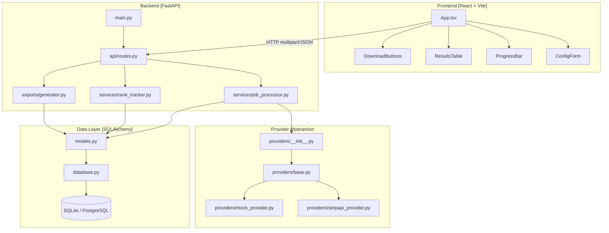
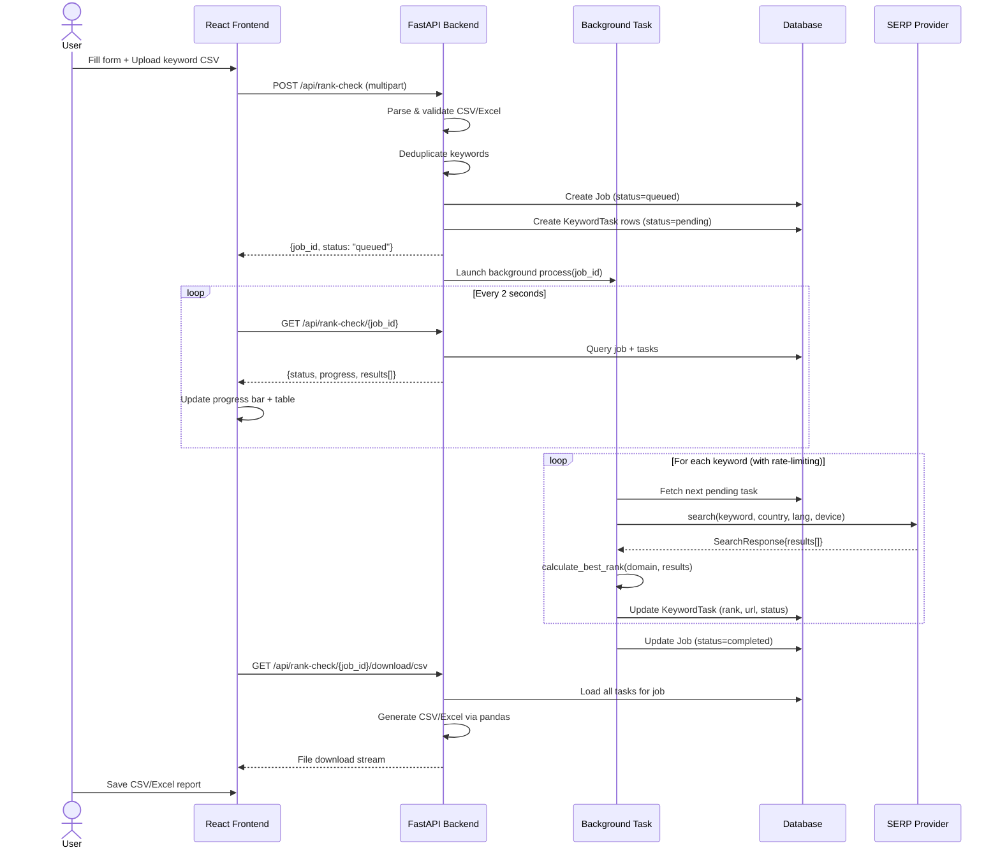

<div align="center">

# 🔍 An Automated Google Keyword Rank Tracker

### A full-stack project for tracking Google keyword rankings across countries, languages, and devices.

[](https://python.org)
[](https://fastapi.tiangolo.com)
[](https://react.dev)
[](https://sqlite.org)

</div>

## 📖 Table of Contents

1. [Why I Built This](#why-i-built-this)
2. [What the Project Does](#what-the-project-does)
3. [How I Would Explain This Project in an Interview](#how-i-would-explain-this-project-in-an-interview)
4. [System Design](#system-design)
5. [Why I Chose These Technologies](#why-i-chose-these-technologies)
6. [Important Design Decisions](#important-design-decisions)
7. [Domain Matching Logic](#domain-matching-logic)
8. [Database Schema](#database-schema)
9. [How I Would Scale It](#how-i-would-scale-it)
10. [Testing](#testing)
11. [CI / CD](#ci--cd)
12. [Security](#security)
13. [What I Learned](#what-i-learned)
14. [Known Limitations](#known-limitations)
15. [Future Improvements](#future-improvements)
16. [Quick Start](#quick-start)

---

## Why I Built This

I built this project after looking at how SEO teams manually check keyword rankings. The process is repetitive: search for a keyword, scan the results, find the target domain, record the position, and repeat. I wanted to automate that workflow while still making the system easy to understand and extend. 

---

## What the Project Does

1. The user enters their company/domain details.
2. The user uploads a CSV or Excel file of keywords.
3. The backend creates a job to track progress.
4. Keywords are processed through a SERP (Search Engine Results Page) API provider.
5. The application checks whether the target domain appears in the results.
6. The best ranking position is stored.
7. The frontend displays real-time progress and results.
8. The user can download CSV/XLSX results.

---

## How I Would Explain This Project in an Interview

I built an automated keyword rank tracker. The user uploads a list of keywords and provides a target domain, country, language, and device. The React frontend sends this to a FastAPI backend, which creates a job and processes each keyword through a SERP provider. I separated the provider behind an interface so I could use a mock provider for development and swap providers later.

The main logic challenge was domain matching. I didn't want simple string matching because that could produce false positives. I normalize the hostname and match either the exact domain or a valid subdomain. 

For the current project, FastAPI BackgroundTasks keeps the system simple. At larger scale, I'd move processing to Redis + worker processes and use PostgreSQL.

---

## System Design

### High-Level Architecture

```text
┌──────────────────────────────────────────────────────────────────────┐
│                           CLIENT LAYER                               │
│                                                                      │
│   ┌─────────────────────────────────────────────────────────────┐   │
│   │  React SPA (Vite + TypeScript + Tailwind CSS)               │   │
│   │  • Configuration Form  • Live Progress Bar  • Results Table │   │
│   │  • CSV Upload          • Download Reports                   │   │
│   └──────────────────────────┬──────────────────────────────────┘   │
└─────────────────────────────┼────────────────────────────────────────┘
                              │ HTTP REST (JSON + multipart/form-data)
                              ▼
┌──────────────────────────────────────────────────────────────────────┐
│                          API GATEWAY LAYER                           │
│                                                                      │
│   ┌─────────────────────────────────────────────────────────────┐   │
│   │  FastAPI (Python 3.11)                                      │   │
│   │  • CORS Middleware  • Request Validation (Pydantic)         │   │
│   │  • OpenAPI Docs     • BackgroundTasks                       │   │
│   └──────────────────────────┬──────────────────────────────────┘   │
└─────────────────────────────┼────────────────────────────────────────┘
                              │
               ┌──────────────┴──────────────┐
               ▼                             ▼
┌──────────────────────┐       ┌──────────────────────────────────────┐
│   DATABASE LAYER     │       │       SERVICE LAYER                  │
│                      │       │                                      │
│  SQLAlchemy ORM      │◄─────►│  ┌────────────────────────────────┐ │
│  SQLite (dev)        │       │  │  Job Processor (sync thread)   │ │
│  PostgreSQL (prod)   │       │  │  • Batch orchestration         │ │
│                      │       │  │  • Retry with backoff          │ │
│  Tables:             │       │  │  • Rate-limit awareness        │ │
│  • jobs              │       │  └────────────────┬───────────────┘ │
│  • keyword_tasks     │       │                   │                  │
└──────────────────────┘       │  ┌────────────────▼───────────────┐ │
                               │  │  Rank Tracker Service          │ │
                               │  │  • Domain normalization        │ │
                               │  │  • Subdomain matching          │ │
                               │  │  • Best-rank calculation       │ │
                               │  └────────────────┬───────────────┘ │
                               └───────────────────┼──────────────────┘
                                                   │
                               ┌───────────────────▼──────────────────┐
                               │         PROVIDER LAYER               │
                               │                                      │
                               │  ┌──────────────┐  ┌─────────────┐  │
                               │  │  SerpApi     │  │  Mock       │  │
                               │  │  Provider    │  │  Provider   │  │
                               │  └──────┬───────┘  └─────────────┘  │
                               └─────────┼────────────────────────────┘
                                         │ HTTPS
                                         ▼
                               ┌─────────────────────┐
                               │   SERP API          │
                               │  (serpapi.com)      │
                               │  Proxied Google     │
                               │  Search Results     │
                               └─────────────────────┘
```

The frontend is a React application. The backend is built with FastAPI. SQLAlchemy handles database access. The SERP provider is separated behind an interface so I can replace SerpApi with another provider later without changing the ranking logic. 

### Component Diagram



This diagram shows how code is separated into folders. The frontend communicates with the backend routes, which then kick off services for processing. Providers and Database models are kept completely independent from the web framework itself.

### Data Flow / Sequence Diagram



This sequence diagram illustrates the lifecycle of a request. The user uploads a file, the API immediately responds with a job ID, and then the frontend polls the backend for progress while a background task does the heavy lifting of calling the SERP API.

---

## Why I Chose These Technologies

**React**
I used React because the application needs interactive progress updates and a results table. 

**FastAPI**
I chose FastAPI because it gives me a simple Python API layer, request validation through Pydantic, and automatic Swagger documentation.

**SQLAlchemy**
I used SQLAlchemy so the application is not tightly coupled to SQLite.

**SQLite**
I used SQLite locally because it requires no separate database server.

**PostgreSQL**
For a deployed version, I would move to PostgreSQL because it is better suited for concurrent production workloads.

**SERP Provider Abstraction**
I didn't want the business logic to depend directly on SerpApi. I created a provider interface so the application can use a mock provider during development and a real provider in production.

---

## Important Design Decisions

### BackgroundTasks instead of Celery

**Why I chose it**
For the current project, FastAPI BackgroundTasks was enough because I didn't want to introduce Redis and Celery just to process a small number of jobs. 

**Trade-off**
The downside is that the jobs are in-process. If the server restarts, a running job can be lost.

**What I would do at larger scale**
I would move job execution into a proper worker queue such as Celery + Redis.


### Status Enum Instead of Boolean

**Why I chose it**
Using distinct statuses (`found`, `not_found`, `rate_limited`, `api_error`, `timeout`) instead of a simple boolean makes debugging much easier. If something fails, I know if it's because the domain didn't rank, or if the API failed.

**Trade-off**
It adds a bit of complexity to the database schema and UI logic.

**What I would do at larger scale**
I'd keep this, but add a separate table for error logs to store the full API stack traces when `api_error` happens.

---

## Domain Matching Logic

The tricky part is deciding whether a SERP URL actually belongs to the target domain. A simple string search would create false positives. For example, `hiree.com.evil.com` should not match `hiree.com`.

I normalize the hostname first and then use exact matching or `endswith("." + target_domain)`.

### Normalization Algorithm

```python
def normalize_domain(url_or_domain: str) -> str:
    # 1. Lowercase + strip whitespace
    url = url_or_domain.lower().strip()
    
    # 2. Ensure URL scheme for urlparse
    if not url.startswith(("http://", "https://")):
        url = "http://" + url

    # 3. Parse and extract host
    domain = urllib.parse.urlparse(url).netloc
    
    # 4. Strip www prefix
    if domain.startswith("www."):
        domain = domain[4:]
    
    return domain
```

### Match Algorithm

```python
def match_domain(target_domain: str, result_url: str) -> bool:
    normalized_target = normalize_domain(target_domain) 
    normalized_result = normalize_domain(result_url)     
    
    return (
        normalized_result == normalized_target or
        normalized_result.endswith("." + normalized_target)
    )
```

**Examples handled correctly:**
| Result URL | Target Domain | Match? | Reason |
|---|---|---|---|
| `https://hiree.com/assessment` | `hiree.com` | ✅ | Exact match |
| `https://app.hiree.com` | `hiree.com` | ✅ | Subdomain |
| `https://hiree.com.evil.com` | `hiree.com` | ❌ | TLD mismatch |

---

## Database Schema

```text
┌─────────────────────────────────────────┐
│                  jobs                   │
├────────────────┬────────────────────────┤
│ id             │ VARCHAR (UUID, PK)      │
│ status         │ ENUM                    │
│ company_name   │ VARCHAR                │
│ domain         │ VARCHAR                │
│ country        │ VARCHAR                │
│ language       │ VARCHAR                │
│ device         │ VARCHAR                │
│ depth          │ INTEGER                │
│ created_at     │ DATETIME               │
└────────────────┴────────────────────────┘
         │
         │ 1:N
         ▼
┌─────────────────────────────────────────┐
│             keyword_tasks               │
├────────────────┬────────────────────────┤
│ id             │ INTEGER (PK, autoincr) │
│ job_id         │ VARCHAR (FK → jobs.id) │
│ keyword        │ VARCHAR, INDEXED       │
│ rank           │ INTEGER (nullable)     │
│ ranking_url    │ VARCHAR (nullable)     │
│ status         │ ENUM                   │
└────────────────┴────────────────────────┘
```

I have two main entities: `Job` and `KeywordTask`. A Job represents one complete rank-check request. Each uploaded keyword becomes a KeywordTask associated with that job. 

This makes it easier to track progress and retry individual keyword requests. 

Job status and keyword status are separate because the overall job can still be processing even when individual keyword lookups have different outcomes.

---

## How I Would Scale It

At the current scale, a FastAPI background task is enough. If usage increased significantly, I would separate API requests from job execution. 

```text
React
   |
FastAPI
   |
Redis / Queue
   |
Workers
   |
PostgreSQL
```

This would prevent the web server from being overwhelmed by long-running SERP lookups and would make it possible to retry jobs across multiple servers. 

---

## Testing

Current tests focus on the domain matching logic because incorrect matching would directly affect ranking accuracy. 

I created a mock provider so I could test the system without spending API credits or making network requests.

Future tests would include:
* API integration tests
* File validation tests
* Provider mock tests
* Job processing tests
* Export tests

---

## CI / CD

Currently, the project can be tested locally with Pytest. A natural next step would be GitHub Actions to automatically run tests and build the frontend on every push.

---

## Security

* Secrets are stored in environment variables.
* The `.env` file should not be committed.
* Uploaded file types are validated before parsing.
* SQLAlchemy is used for database queries, preventing SQL injection.
* CORS should be restricted in deployment.
* HTTPS should be used in production.
* Authentication should be added before exposing the API publicly.
* The project obtains SERP data through a third-party SERP API instead of directly scraping Google.

---

## What I Learned

* Designing APIs around asynchronous work
* Separating business logic from external providers
* Handling file uploads and validation
* Designing relational database relationships
* Thinking about retries and API failures
* Handling URL/domain normalization
* Building a frontend around backend job progress
* Thinking about how a small system could be scaled

---

## Known Limitations

* Background jobs currently run in-process.
* Jobs can be lost if the application restarts.
* Authentication is not currently implemented.
* PostgreSQL is supported architecturally but SQLite is the easiest local setup.
* There is currently limited automated test coverage.
* Observability/metrics are basic.
* SERP provider pricing and rate limits depend on the provider.

---

## Future Improvements

* Replace BackgroundTasks with a Redis-backed worker queue.
* Add PostgreSQL + Alembic migrations.
* Add authentication and per-user jobs.
* Add API rate limiting.
* Add retry policies with exponential backoff.
* Add more SERP providers such as DataForSEO.
* Add historical ranking charts.
* Add automated CI tests.
* Add monitoring and structured logs.

---

## Quick Start

### Local Development (Windows)

This setup uses SQLite and a Mock provider by default.

**1. Start Backend**
```powershell
cd backend
python -m venv venv
.\venv\Scripts\activate
pip install -r requirements.txt
copy ..\.env.example .env

uvicorn main:app --reload --port 8000
```

**2. Start Frontend**
```powershell
cd frontend
npm install
npm run dev
```

### Local Development (macOS / Linux)

**1. Start Backend**
```bash
cd backend
python -m venv venv
source venv/bin/activate
pip install -r requirements.txt
cp ../.env.example .env

uvicorn main:app --reload --port 8000
```

**2. Start Frontend**
```bash
cd frontend
npm install
npm run dev
```

### Using a Real SERP Provider

To pull real Google rankings, update `backend/.env`:

```env
SERP_PROVIDER=serpapi
SERP_API_KEY=your_key
```

*Note: SerpApi offers different plans and quotas. Pricing changes over time, so check the official pricing page before using it in a deployed application.*
